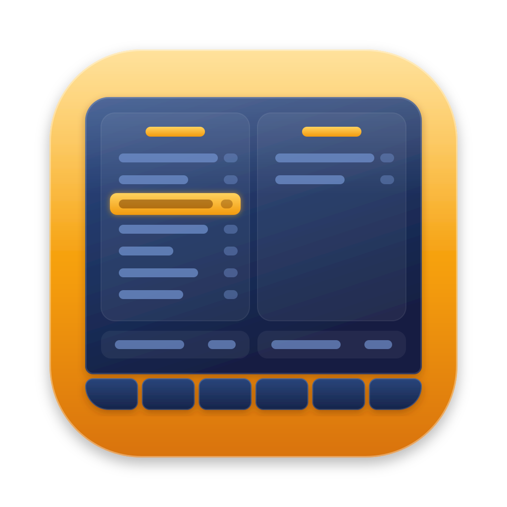

# Noon Commander



A Rust-based terminal file manager for macOS and Linux, focused on seamless local and SFTP file
operations. The command is `noc`.

> **Status: pre-alpha.** You can browse local directories and SFTP hosts, and copy, move,
> delete, view, and edit files between them; polish comes next. See the
> [roadmap](docs/roadmap.md).

<br clear="right">

## Why

- **Two panels and mc keys.** Copy, move, rename, view, and delete files on your machine, between
  your machine and your servers, or between two servers. The keys are the ones you know from
  Midnight Commander.
- **SFTP at the core.** Remote hosts are not an add-on: Noon Commander was started to make SFTP
  feel as natural as the local disk, and remote files work just like local ones.
- **Your `~/.ssh/config` just works.** Noon Commander never implements SSH. It runs the `ssh` you
  already use, so `ProxyJump`, `Match`, `Include`, agents, FIDO keys, certificates, and
  `known_hosts` behave exactly as in your terminal.
- **Every disk and server in one place.** The virtual root lists the mounted volumes and all
  hosts from your ssh config; Alt-F1 and Alt-F2 switch a panel to any of them, as in Far
  Manager.
- **Tabs in each panel.** Keep several directories and servers open on each side, and switch
  between them with Alt-Left and Alt-Right.
- **zoxide built in.** Alt-Z jumps to the directories [zoxide](https://github.com/ajeetdsouza/zoxide)
  ranks, and the directories you work in from Noon Commander count there too.

## Philosophy

- A full file manager: local and remote files are equally first-class. SFTP is the foundation,
  and more backends may follow.
- The system OpenSSH client is the single source of truth for connections and authentication.
  Noon Commander never links an SSH library and never stores passwords.
- SFTP channels get the same safety options as the stock `sftp(1)` client.
- Port, agent, and X11 forwarding are compiled out by default
  ([ADR 0004](docs/adr/0004-forwarding-compile-time-feature.md)).
- The UI never waits on the network: every remote operation is asynchronous, cancellable, and
  shows progress.

Non-goals: forwarding of any kind, a built-in SSH implementation, a password manager, editing
`~/.ssh/config` or `known_hosts`.

## Planned features

- Virtual root with the mounted volumes and all hosts from `ssh_config`.
- Copy and move between local and remote, or between two remote hosts.
- Password, OTP, and host-key prompts inside the TUI (via `SSH_ASKPASS`).
- One authentication per host, shared by all panels and transfers (OpenSSH `ControlMaster`).
- Configurable `ssh` binary and extra arguments.
- Nerd Font icons, on by default.
- Midnight Commander keybindings; a vim preset may follow.

## Requirements

- macOS (Linux support is planned).
- OpenSSH 8.7 or newer: check with `ssh -V`.
- Rust 1.88 or newer to build from source.

## Installing

On macOS, with [Homebrew](https://brew.sh):

```sh
brew install noon-commander/tap/noon-commander
```

The [releases](https://github.com/noon-commander/noon-commander/releases) also have tarballs
for Apple Silicon and Intel Macs, each with a build provenance attestation that
`gh attestation verify` checks ([packaging/README.md](packaging/README.md#checking-a-download)).
The binaries are not notarized, so macOS blocks `noc` from a tarball downloaded with a browser
until `xattr -d com.apple.quarantine noc` removes the mark; Homebrew sets none.

## Building

### Prerequisites

- A Rust toolchain, 1.88 or newer, installed with [rustup](https://rustup.rs):

  ```sh
  curl --proto '=https' --tlsv1.2 -sSf https://sh.rustup.rs | sh
  rustup update stable
  ```

- A C toolchain for linking: `xcode-select --install` on macOS, or `build-essential` (Debian,
  Ubuntu) or `base-devel` (Arch) on Linux.
- OpenSSH 8.7 or newer at runtime (`ssh -V`).
- Development tools (optional): [just](https://github.com/casey/just) runs the project's tasks,
  [resvg](https://github.com/linebender/resvg) renders the logo,
  [cargo-deny](https://github.com/EmbarkStudios/cargo-deny) checks licenses and advisories,
  [markdownlint-cli2](https://github.com/DavidAnson/markdownlint-cli2) checks the Markdown files,
  [ShellCheck](https://www.shellcheck.net) checks the shell scripts,
  [cargo-insta](https://insta.rs) reviews the UI snapshots,
  [typos](https://github.com/crate-ci/typos) finds misspelled words,
  [cargo-shear](https://github.com/Boshen/cargo-shear) finds unused dependencies,
  [taplo](https://taplo.tamasfe.dev) checks and formats the TOML files,
  [actionlint](https://github.com/rhysd/actionlint) checks the GitHub Actions workflows,
  [zizmor](https://docs.zizmor.sh) audits their security,
  [cargo-edit](https://github.com/killercup/cargo-edit) shows newer dependency versions, and
  [VHS](https://github.com/charmbracelet/vhs) takes the screenshots (only for `just demo`; it
  needs ttyd and ffmpeg, and a [Nerd Font](https://www.nerdfonts.com) for the icons):

  ```sh
  brew install just resvg cargo-deny markdownlint-cli2 shellcheck cargo-insta typos-cli \
      cargo-shear taplo actionlint zizmor cargo-edit vhs
  # or, on any platform (ShellCheck, ttyd, and ffmpeg from your package manager):
  cargo install just resvg cargo-deny cargo-insta typos-cli cargo-shear taplo-cli zizmor \
      cargo-edit --locked
  npm install --global markdownlint-cli2
  go install github.com/rhysd/actionlint/cmd/actionlint@latest
  go install github.com/charmbracelet/vhs@latest
  ```

### Build and run

```sh
git clone https://github.com/noon-commander/noon-commander.git
cd noon-commander
cargo build --release
./target/release/noc --version
./target/release/noc
```

With [just](https://github.com/casey/just), `just release` builds the same binary and `just run`
starts a development build; arguments after it go to `noc`, as in `just run --version`.

The version line shows the compile-time features, e.g. `noc 0.1.0 (-forwarding)`.

### Install

To put `noc` into `~/.cargo/bin` (make sure it is on your `PATH`):

```sh
cargo install --path crates/noc --locked
```

### Optional features

Port, agent, X11, and tunnel forwarding are compiled out by default
([ADR 0004](docs/adr/0004-forwarding-compile-time-feature.md)). To build with them:

```sh
cargo build --release --features forwarding
```

### Tests

```sh
cargo test --workspace
just test    # with and without the forwarding feature
```

The SFTP tests run against the local `sftp-server` over pipes, with no network and no real
`ssh`. If it is not in a standard location (`/usr/libexec/sftp-server` on macOS,
`/usr/lib/openssh/sftp-server` on Debian and Ubuntu), set `SFTP_SERVER` to its path; otherwise
those tests are skipped. The full set of checks is listed in [AGENTS.md](AGENTS.md#commands).

### Tasks

The project's tasks live in the [`justfile`](justfile)
([ADR 0013](docs/adr/0013-just-task-runner.md)), and CI runs the same recipes:

| Command | What it does |
| --- | --- |
| `just` | List the tasks |
| `just check` | Formatting, clippy, tests, and cargo-deny: everything that must pass; changes no files |
| `just lint` | Markdown, shell scripts, spelling, TOML, workflows, and unused dependencies |
| `just all` | `check`, `lint`, and `snap-stale`: every check there is |
| `just fmt` | Format the code |
| `just build` | Build the workspace for development |
| `just release` | Build the optimized binary into `target/release/noc` |
| `just run` | Run `noc` from the sources; arguments go to `noc` |
| `just release-tag X.Y.Z` | Commit the version bump, sign the tag, and push them, which starts a release ([packaging/README.md](packaging/README.md#making-a-release)) |
| `just test` | Tests with and without the forwarding feature |
| `just snap` | Run the tests and review the UI snapshots that changed (needs cargo-insta) |
| `just snap-stale` | Fail if a snapshot file has no test left (needs cargo-insta) |
| `just msrv` | Build with the oldest supported Rust (needs rustup) |
| `just md` | Lint the Markdown files with `.markdownlint.yaml` (needs markdownlint-cli2) |
| `just typos` | Find misspelled words in code and docs; exceptions go to `typos.toml` (needs typos) |
| `just unused` | Find dependencies that no crate uses (needs cargo-shear) |
| `just toml` | Check that the TOML files are valid and formatted (needs taplo) |
| `just toml-fmt` | Format the TOML files, keeping their comments (needs taplo) |
| `just outdated` | Show newer versions of the dependencies, without changing anything (needs cargo-edit) |
| `just gha` | Lint the GitHub Actions workflows and audit their security, pedantically (needs actionlint, zizmor) |
| `just sh` | Lint the shell scripts, such as the fake `ssh` of the tests (needs shellcheck) |
| `just logo` | Render the PNGs of `assets/icons/logo.svg`, without metadata (needs resvg) |
| `just demo` | Take the screenshots of `docs/demo/*.tape` in a made-up home with made-up hosts (needs vhs) |

`just logo` renders every PNG listed in the `logo` recipe, for now
`assets/icons/logo-github.png` (512 × 512, the GitHub avatar). To add one, add a
`(_logo-png "name" "size")` to that recipe.

`just demo` builds `noc`, makes a world for it in `/tmp/noc-demo` with
[`docs/demo/setup.sh`](docs/demo/setup.sh), and plays every `docs/demo/*.tape` in VHS, which
writes the screenshots to `assets/screenshots/`. That world has its own home directory, settings,
and `ssh_config`, and a fake `ssh` that serves the made-up hosts from local directories, so no
real file, host, or name shows. The paths in the panel titles still show where it lives. The tapes
use the font SauceCodePro Nerd Font Mono; with another one, change `Set FontFamily`.

## Configuration

Configuration lives in `~/.config/noc/`, following the XDG layout on macOS too;
`noc config init` writes the commented defaults, and `noc config paths` shows every file and
directory Noon Commander uses.

## Contributing

See [AGENTS.md](AGENTS.md) for the project rules, layout, and commands. They apply to humans and
AI agents alike.

## License

Copyright (C) 2026 0ldkettle

Noon Commander is free software: you can redistribute it and/or modify it under the terms of the
GNU General Public License as published by the Free Software Foundation, either version 3 of the
License, or (at your option) any later version.

Noon Commander is distributed in the hope that it will be useful, but WITHOUT ANY WARRANTY;
without even the implied warranty of MERCHANTABILITY or FITNESS FOR A PARTICULAR PURPOSE. See the
[GNU General Public License](LICENSE) for more details.
